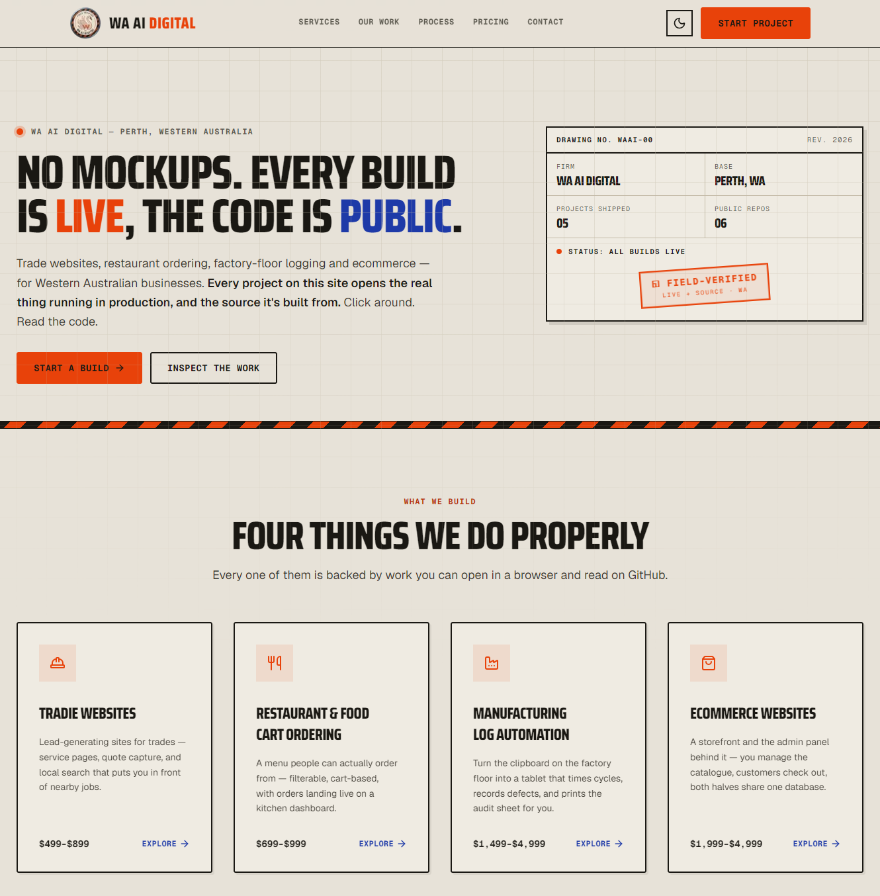

<div align="center">


# WA AI Digital

**Marketing site for a Perth-based web and automation studio.**

[**waai.au**](https://waai.au) · [Services](https://waai.au/services) · [Our Work](https://waai.au/work) · [Contact](https://waai.au/#contact)

</div>

<div align="center">
  <a href="https://waai.au">
    
  </a>
</div>

---

## What this is

A Next.js 16 App Router site for WA AI Digital (Perth / Waikiki, Western
Australia). It's a single scrolling landing page plus two content-driven route
trees (`/services/*`, `/work/*`), a Chainlit chatbot embed, and one API route
that emails contact-form enquiries.

It runs on **Cloudflare Workers** via the OpenNext adapter — a real server
build, not a static export, because the contact form needs a live POST handler.

## Getting started

```bash
npm install
npm run dev     # http://localhost:3000
```

To exercise the contact form locally, copy `.dev.vars.example` to `.dev.vars`
and drop in a [Resend](https://resend.com/api-keys) API key. Without it the
route returns a 500 — everything else on the site works fine.

### Commands

| Command | What it does |
| --- | --- |
| `npm run dev` | Dev server on http://localhost:3000 |
| `npm run build` | Production Next.js build |
| `npm start` | Serve the production build |
| `npm run lint` | ESLint (flat config, `next/core-web-vitals` + TypeScript) |
| `npm run preview` | Build for Workers and preview locally via Wrangler |
| `npm run deploy` | Build and deploy to Cloudflare Workers |
| `npm run cf-typegen` | Regenerate `cloudflare-env.d.ts` from `wrangler.jsonc` |

There is no test suite in this repo.

## Stack

- **Next.js 16** (App Router) · **React 19** · **TypeScript** (strict)
- **Tailwind CSS v4** — CSS-first, no `tailwind.config`
- **Saira Condensed** (display) + **Geist Sans/Mono** via `next/font`
- **framer-motion** for entrance animations
- **shadcn/ui** (`radix-nova` style) on Radix primitives
- **Cloudflare Workers** via `@opennextjs/cloudflare` + Wrangler
- **Resend** for transactional email

`@/*` resolves to the repo root.

## Layout

```
app/
  (sections)/          landing-page sections — NOT routes
    hero · services · featured-work · process · pricing · growth · contact
  services/            /services and /services/[slug]
  work/                /work and /work/[slug]
  chat/                full-viewport iframe onto the hosted Chainlit bot
  api/contact/         POST handler → Resend
  layout.tsx           header, footer, theme pre-paint script, scroll-to-top
  globals.css          every theme token lives here
components/
  header.tsx · footer.tsx · theme-toggle.tsx · service-card.tsx ·
  case-study-card.tsx · ui/
lib/content/
  services.ts          SERVICES — drives /services/[slug]
  case-studies.ts      CASE_STUDIES — drives /work/[slug]
public/work/           case-study screenshots (.webp)
```

### `app/(sections)/` is not a route group in the usual sense

The parenthesised folder holds the landing-page *sections*; none of them are
pages. `app/page.tsx` imports and stacks them in order, and `components/header.tsx`
links to `#process`, `#pricing` and `#contact` — so **a section's `id` attribute
is the contract with the header nav.** Adding a section means adding a file
here, rendering it in `app/page.tsx`, and adding the nav link.

### Content is data, not markup

Services and case studies live in `lib/content/*.ts` as typed arrays.
`/services/[slug]` and `/work/[slug]` are generated from them, and the landing
page's cards read the same source. To add a service or a case study, add an
entry to the array — don't hand-write a page.

## Styling conventions

The visual language is **"Site Notice"** — a Western Australian worksite
spec-sheet: warm concrete + ink, one hi-vis signal (the live product / primary
action) and one cobalt signal (the open source), engineering title-blocks,
plate-framed screenshots, and a field-verification stamp as the signature mark.
It's grounded in the actual clients (tradies, a smokehouse, a rubber-press
floor), not a generic dark-cyber SaaS look.

**Light by default, dark on request, OS as the fallback.** Theme is a
`data-theme="light"|"dark"` attribute on `<html>`, set before first paint by an
inline script in `app/layout.tsx` (stored choice, else the OS) so there's no
flash. `components/theme-toggle.tsx` (in the header) flips and persists it to
`localStorage`. In `app/globals.css`: `:root` is light, `@media
(prefers-color-scheme: dark) :root:not([data-theme])` is the OS/no-JS dark
fallback, and `:root[data-theme="dark"]` is the explicit choice — the two dark
blocks are kept in sync by hand. Every brand colour is an indirection onto
these tokens, so add a new one to **all three** blocks, never as a bare hex in
a component.

Reach for the tokens and the shared material classes rather than raw colours:

- `bg-hivis` / `text-hivis-text` (small text only — hi-vis fails contrast as
  body copy) / `text-source` — the two brand signals
- `.glass-card` (the spec panel), `.glass-nav` (header bar), `.btn-primary` /
  `.btn-glass`, `.tag-live` / `.tag-src`, `.stamp`, `.hazard-rule` (use once),
  `.field-input`, `.focus-ring`
- semantic tokens (`text-foreground`, `text-muted-foreground`, `border-border`,
  `bg-card`) so shadcn primitives stay consistent across both themes

> [!IMPORTANT]
> **`text-foreground-subtle` (steel) is metadata only, never body copy** — it's
> APCA-borderline as running text. Body copy uses `text-muted-foreground` or
> `text-foreground`.

Type is three faces: `font-display` (Saira Condensed, headings/labels,
uppercase) · `font-sans` (Geist, body) · `font-mono` (Geist Mono — the
datasheet voice: URLs, stacks, prices, plate labels).

Entrance animations use framer-motion `initial` / `whileInView` with
`viewport={{ once: true }}` and a `delay: index * 0.1` stagger (see
`components/ui/feature-card.tsx`). `"use client"` is applied only to files that
need state or motion; sections without interaction stay server components.

**The footer signature** — "Smoked & Coded by: jeric" with a flickering flame
and rising smoke (`components/footer.tsx`) — runs on a hand-tuned beat and stays
animating even under `prefers-reduced-motion` via `.motion-always`. If you touch
it, recolour freely; don't retime it.

**Tailwind v4 is CSS-first.** All theme tokens live in `app/globals.css` — a
plain `@theme` block for literal values (the flame/smoke keyframes), a `@theme
inline` block for the indirections onto `:root`, alongside `@import
"shadcn/tailwind.css"`. There is **no `tailwind.config.{js,ts}`**, and adding
one would do nothing: v4 only reads a config via an `@config` directive, which
`globals.css` deliberately does not have.

Note `--radius` (0.2rem, squared) drives the whole `--radius-sm…4xl` scale
through `calc()`, so changing it rescales every radius on the site; chips opt
back into `rounded-full` explicitly.

## Contact form

`app/api/contact/route.ts` validates the payload and posts to Resend's HTTP
API — the only viable route on Workers, which has no raw TCP sockets and so
can't speak SMTP. Mail is sent **from** `hello@waai.au` (DKIM/SPF-verified in
Resend) but delivered **to** the owner's inbox directly, not back to
`hello@waai.au`, which is forwarded to that same inbox by Cloudflare Email
Routing — addressing it there would loop through the forwarder and read as
spam.

> [!WARNING]
> On the OpenNext Cloudflare adapter, `.dev.vars` and Worker secrets are **not**
> bridged onto `process.env`. Read them from `getCloudflareContext().env` —
> `process.env.RESEND_API_KEY` is silently `undefined` even when the secret is
> set correctly. See the [OpenNext bindings docs](https://opennext.js.org/cloudflare/bindings).

## Deploying

```bash
npx wrangler secret put RESEND_API_KEY   # once, per environment
npm run deploy
```

`wrangler.jsonc` points at `.open-next/worker.js` with `nodejs_compat`, the
Images binding, and observability enabled. `npm run preview` gives you the same
Workers runtime locally before you ship.

## The chat route

`app/chat/page.tsx` is a full-viewport `<iframe>` onto an externally hosted
Chainlit RAG chatbot (`jericrealubit-ragchatbot.hf.space`), positioned `fixed`
at `z-index: 99999` with inline styles so it covers the root layout's header,
footer and padding. **There is no chat backend in this repo.**

---

<div align="center">

Built in Western Australia · [waai.au](https://waai.au)

</div>
